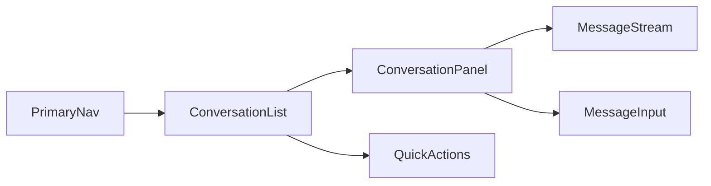

# IM 前端 UI 重设计需求文档（私聊 + 聊天室）

## 1. 背景与问题

当前产品在“大厅页 + 聊天页”之间存在割裂：

- 大厅页左侧是好友列表，右侧是聊天室列表，信息架构不统一。
- 点击“进入聊天页”后跳转到新页面，但新页面缺少好友列表，用户需要在不同页面来回切换。
- 退出聊天室后才能返回大厅，主流程存在“多一步操作”的认知负担。
- 未来扩展其他模块（如通知、联系人管理、设置、群管理）时，现有双页结构不利于扩展。

用户反馈核心诉求：

1. 私聊和聊天室应在同一套主界面内协同，不应分裂为两个主要页面。  
2. 聊天操作应像 PC 微信客户端一样，围绕“会话列表 + 当前会话面板”展开。  
3. 设计要为后续模块扩展预留空间，但本期只聚焦私聊与聊天室。

---

## 2. 目标与范围

## 2.1 目标

- 统一聊天入口：私聊与聊天室均在同一页面完成。
- 降低切换成本：用户无需“进聊天页/退聊天页”。
- 明确信息层级：会话列表与消息面板职责清晰。
- 可扩展：为后续新增模块预留导航结构，不破坏当前布局。

## 2.2 本期范围（In Scope）

- 桌面端（PC）UI 信息架构重设计。
- 私聊与聊天室并存的会话体系。
- 页面级交互流程、组件职责、状态规则、验收标准。

## 2.3 非本期范围（Out of Scope）

- 视觉品牌重塑（配色体系、全套视觉规范大改）。
- 音视频通话、文件中心、消息搜索高级能力。
- 移动端适配细节（可后续单独文档定义）。

---

## 3. 设计原则

- **单一工作台原则**：用户聊天相关任务在一个主工作台完成。  
- **会话优先原则**：用户先选会话，再在右侧完成沟通。  
- **最少跳转原则**：避免跨页面跳转，优先面板切换。  
- **一致性原则**：私聊和聊天室共享相同会话行为（选中、未读、置顶、草稿状态等）。  
- **可生长原则**：导航结构从一开始支持新增模块，不推翻现有框架。

---

## 4. 目标信息架构（IA）

建议采用三栏布局（参考 PC 微信思路，结合当前业务精简）：

1. **一级导航栏（最左窄栏）**
   - 会话（默认）
   - 通讯录（预留）
   - 发现/业务扩展（预留）
   - 设置（预留）

2. **二级列表栏（左侧主列表）**
   - 当前一级导航下的列表内容：
     - 会话模式：展示“私聊 + 聊天室”的统一会话列表
     - 通讯录模式：展示好友列表/群列表（后续）

3. **内容栏（右侧大面板）**
   - 展示当前选中会话的消息流与输入区
   - 未选中会话时显示空状态引导

---

## 5. 核心交互重设计

## 5.1 会话统一模型

将“好友私聊”和“聊天室”统一为 `Conversation` 概念：

- `conversationType`: `private` | `room`
- `conversationId`: 唯一会话标识
- `title`: 显示名（昵称或聊天室名）
- `avatar`
- `lastMessage`
- `lastMessageTime`
- `unreadCount`
- `isPinned`（预留）

用户不再先进入“某个页面”，而是直接在会话列表中点击目标会话开始聊天。

## 5.2 页面行为

- 默认进入主工作台后，停留在“会话”模式。
- 左侧会话列表包含：
  - 私聊会话（基于好友关系生成或首次消息后生成）
  - 聊天室会话（已加入聊天室）
- 点击任一会话：
  - 右侧立即切换消息面板
  - 清除该会话未读计数
  - 拉取对应历史消息（私聊或聊天室）

## 5.3 去除“进入聊天页/退出回大厅”的割裂流程

- 移除当前“大厅页 -> 聊天页”的主要路径依赖。
- 保留路由可兼容，但用户层面应始终在统一工作台中完成操作。
- 聊天室“退出”行为仅表示退出该聊天室，不应触发“页面跳转回大厅”。

## 5.4 列表操作建议

- 会话列表项支持：
  - 点击进入会话
  - 显示未读角标
  - 显示最后一条消息摘要
  - 显示时间
- 会话列表顶部支持：
  - 搜索（按昵称/聊天室名）
  - 快捷创建/加入聊天室（按权限）
  - 添加好友入口（可放到“通讯录”后续迁移）

---

## 6. 状态与数据规则

## 6.1 私聊会话生成规则

- 已是好友但无历史消息：可展示为空会话（可配置）。
- 收到/发送私聊后：自动出现在会话列表并更新最后消息。

## 6.2 聊天室会话规则

- 已加入聊天室显示为会话项。
- 退出聊天室后从会话列表移除或置灰（二选一，产品确认）。

## 6.3 未读规则

- 非当前会话收到新消息：`unreadCount +1`
- 切换到该会话：清零该会话未读
- 列表总未读可在一级导航图标角标体现（预留）

## 6.4 历史消息拉取规则

- 私聊：调用 `/message/private/history?userId={uid}&friendId={friendId}&current=1&size=20`
- 聊天室：调用 `/message/chatroom/history?roomId={roomId}&current=1&size=20`
- 请求前必须校验参数合法性，禁止出现 `friendId=undefined`、`roomId=undefined`

---

## 7. 扩展性预留（面向后续模块）

一级导航建议预留以下模块位（先占位，后开发）：

- 会话（本期）
- 通讯录（好友管理、群管理）
- 通知/待办（系统消息）
- 业务扩展（可插拔）
- 设置

要求：

- 新模块接入不改变主三栏骨架。
- 每个模块可定义自己的二级列表与内容面板，但复用统一布局容器。

---

## 8. 需求验收标准（本期）

## 8.1 交互验收

- 用户进入应用后，在单一主界面可完成：
  - 选择私聊会话并聊天
  - 选择聊天室会话并聊天
- 不再依赖“进入聊天页/退出回大厅”完成主流程。
- 点击会话后右侧面板必然切换到对应聊天窗。

## 8.2 数据验收

- 私聊历史接口与聊天室历史接口参数正确且稳定，不出现 `undefined` 参数。
- 未读数在会话级别正确增减。
- 私聊与聊天室消息实时收发保持可用。

## 8.3 可扩展性验收

- 一级导航可扩展到至少 4 个模块，不影响现有会话功能。
- 现有会话 UI 不依赖“特定业务页面”才能工作。

---

## 9. 分阶段落地建议（非代码）

### Phase A（结构统一）

- 合并大厅与聊天页为统一工作台路由（或保留兼容路由但统一渲染）。
- 建立统一会话列表模型（私聊 + 聊天室）。

### Phase B（行为收口）

- 统一会话点击、未读清理、历史拉取逻辑。
- 去除“聊天室退出触发页面跳转”的行为耦合。

### Phase C（体验优化）

- 会话搜索、置顶、最近会话排序。
- 空状态引导与错误提示优化。

---

## 10. 风险与注意事项

- 当前代码中私聊与聊天室分属不同 store，重设计时需谨慎处理状态边界，避免重复来源。
- 会话统一后，列表更新触发点变多（轮询、WS 推送、手动操作），需统一刷新策略避免抖动。
- 路由兼容期可能出现旧入口与新入口并存，需要明确跳转策略。

---

## 11. 需要你确认的产品决策

1. 聊天室“退出”后，会话列表是直接移除，还是保留灰态入口？  
2. 私聊会话是否在“仅好友但无历史消息”时就显示在会话列表？  
3. 一级导航本期是否先只显示“会话”，其他模块仅保留隐藏占位？

